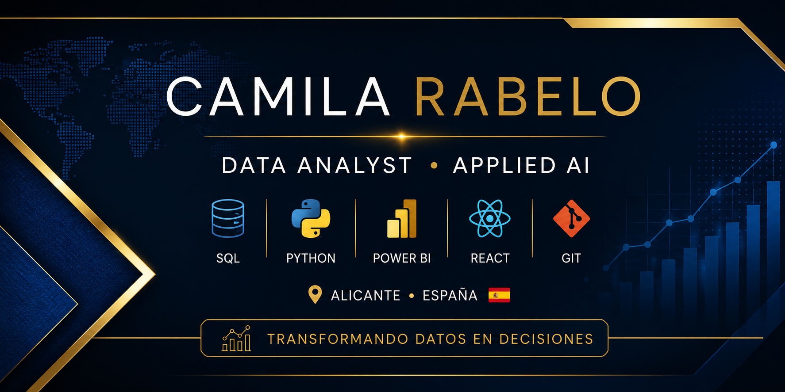

# 

  

👋 ¡Hola! Soy Camila Rabelo

### 📊 Data Analyst | 🤖 Applied AI | 🌐 Web Developer

  
  
  
  
  
  
  
  
  

🌍 **Español · Português · English**  
📍 **Alicante, España**

---

## 👩‍💻 Sobre mí

Soy una profesional con más de **14 años de experiencia internacional** en administración, gestión y operaciones. Actualmente enfocada en **Análisis de Datos** y **IA Aplicada**, combinando experiencia de negocio con habilidades técnicas.

---

## 🏆 Certificaciones y Formación

*   **🎓 Programa de Formación Profesional (En Curso)**
    *   **Enfoque:** Análisis de datos, Inteligencia Artificial aplicada y desarrollo web. (Finalización: Octubre 2026).
*   **📜 Introducción a la Inteligencia Artificial** - Fundación Somos F5 & Iberdrola (*ImpulsIA*).
*   **⚡ Itinerario Formativo de Descubrimiento Tecnológico** - Fundación Somos F5 & Iberdrola (*ImpulsIA*).

---

## 🚀 Proyectos destacados

### 📊 Data Analyst Portfolio
Portfolio técnico enfocado en SQL, Python y Pandas. 🔗 [Data Analyst Portfolio](https://github.com)

### 🧭 Talento sin Fronteras
Plataforma web para empleo en España con integración de IA. 🔗 [Talento sin Fronteras](https://github.com)

### 🌐 PresencIA
Soluciones web y posicionamiento para pymes. 🔗 [PresencIA](https://github.com)

---

## 🛠️ Tecnologías
**Python, SQL, Pandas, SQLite, Power BI, React, Tailwind CSS, Git/GitHub.**

---

## 📫 Contacto
LinkedIn: [://linkedin.com](https://://linkedin.com)

---

## 📈 Estadísticas de GitHub
<table border="0" width="100%">
  <tr>
    <td width="50%" align="center">
      
    </td>
    <td width="50%" align="center">
      
    </td>
  </tr>
</table>

  

